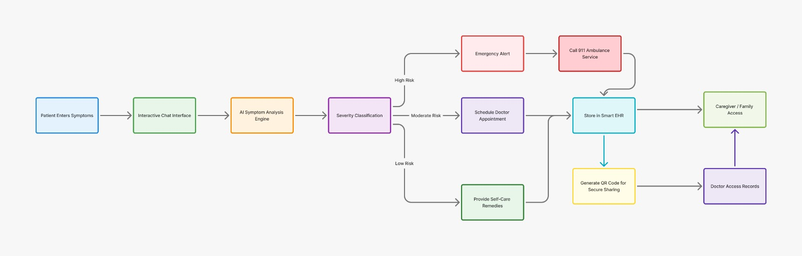

# SymptomSync AI 🏥

An intelligent telemedicine platform combining AI-powered symptom analysis, conversational healthcare assistance, and family-centric care management. Empowering patients with instant risk assessment, secure medical record sharing, and seamless doctor consultations—all in one unified platform.

---

## 🎯 Overview

SymptomSync AI bridges the gap between patients, doctors, and caregivers through intelligent triage, real-time consultations, and secure medical record management. Built with cutting-edge AI technology and designed for accessibility, our platform addresses the $285B telemedicine market with innovative risk assessment and elder-care focused features.

---

## ✨ Key Features

### 🤖 **AI-Powered Symptom Analysis**
- Conversational AI engine analyzes symptoms through natural language processing
- Real-time risk scoring (0-100%) with severity classification
- Structured follow-up questions for comprehensive assessment

### 💬 **Interactive Chat Interface**
- Natural conversational flow for symptom reporting
- Accessible to all age groups with intuitive design
- Multi-step assessment with intelligent context retention

### 📁 **Smart EHR with AI Analysis**
- Secure storage of medical records (X-rays, lab reports, prescriptions)
- AI-powered analysis of medical images and documents
- Automated extraction of key findings and abnormal values

### 📲 **QR Code Medical Sharing**
- Instant, tokenized sharing of medical records
- Secure access control with expiration settings
- No email or app required for recipients

### 📅 **Risk-Based Scheduling**
- Automatic doctor appointment booking for moderate to high-risk cases
- Priority queuing based on AI risk assessment
- Intelligent doctor matching by specialty

### 👨‍👩‍👧 **Family Access System**
- Permission-based caregiver access for elderly patients
- Multi-user support for assisted healthcare management
- Real-time family notifications and updates

### 🔔 **Email Notification System**
- Real-time alerts for appointments and assessments
- Emergency notifications for high-risk cases
- Family access request notifications
- Appointment reminders and confirmations

### 🎥 **Secure Video Consultations**
- Low-latency HD video calls powered by Jitsi API
- HIPAA-compliant end-to-end encryption
- Screen sharing and digital prescription support

---

## 🏗️ System Architecture



**Patient Journey Flow:**
```
Patient Entry → Interactive Chat → AI Symptom Analysis → Severity Classification
                                                                ↓
                                    ┌───────────────────────────┼───────────────────────────┐
                                    ↓                           ↓                           ↓
                            Emergency Alert              Moderate Risk            Provide Self-Care
                          (Call 911 Service)        (Schedule Appointment)          Remedies
                                    ↓                           ↓
                          Store in Smart EHR              Smart EHR Storage
                                    ↓                           ↓
                          Generate QR Code ──────────────────→ QR Code Sharing
                                    ↓                           ↓
                          Caregiver/Family Access     Doctor Access Records
```

---

## 🚀 Competitive Advantage

### What Sets Us Apart:

| Feature | Existing Apps (Practo, 1mg, Apollo) | SymptomSync AI |
|---------|-------------------------------------|----------------|
| **AI Risk Scoring** | ❌ Basic symptom checkers | ✅ Advanced 0-100% risk scoring with ML |
| **Family Access** | ❌ Single user only | ✅ Multi-user caregiver support system |
| **QR Medical Sharing** | ❌ Email/app required | ✅ Instant QR code sharing, no app needed |
| **Elder Care Focus** | ❌ Not prioritized | ✅ Designed for assisted healthcare |
| **AI Medical Analysis** | ❌ Manual review only | ✅ Automated X-ray and lab report analysis |
| **Emergency Triage** | ❌ Manual escalation | ✅ Automatic 911 alerts for critical cases |
| **Smart Scheduling** | ❌ Manual booking | ✅ AI-driven priority appointment booking |

### Key Differentiators:
- **🎯 AI-First Approach**: Real-time risk assessment with visible severity percentages
- **👴 Elder-Centric Design**: Family-assisted healthcare for aging populations
- **🔐 Zero-Friction Sharing**: QR-based instant record access without registration
- **🚨 Intelligent Triage**: Automatic emergency detection and routing
- **📊 Comprehensive Analytics**: Full patient journey tracking and insights

---

## 🛠️ Tech Stack

### Frontend
- **React 19** - Modern UI framework
- **React Router** - Client-side routing
- **Bootstrap 5** - Responsive design system
- **Tambo AI SDK** - Conversational AI integration
- **Socket.io Client** - Real-time communication

### Backend
- **Node.js & Express.js** - REST API server
- **MongoDB & Mongoose** - Database and ODM
- **Google Gemini AI** - Medical analysis engine
- **Jitsi API** - Video conferencing
- **Nodemailer** - Email notifications
- **QRCode** - Medical record sharing
- **JWT** - Authentication & authorization

---

## 📊 Market Opportunity

- **Telemedicine Market**: $285B by 2030 (17-20% CAGR)
- **AI in Healthcare**: $187B by 2030 (driven by risk prediction demand)
- **Elderly Population**: 1 in 6 people will be 65+ by 2050
- **Gap in Market**: Lack of integrated AI triage + family access systems

**Target Users:**
- 🧑‍⚕️ Patients seeking instant health guidance
- 👨‍⚕️ Doctors needing efficient triage tools
- 👴 Elderly patients requiring assisted care
- 👨‍👩‍👧 Families managing loved ones' health


## 📄 License

This project is licensed under the MIT License - see the [LICENSE](LICENSE) file for details.

---

## 👥 Team

Built with ❤️ for healthcare innovation

---

## 📞 Contact

For questions or feedback, please reach out:
- 📧 Email: atharvanaik026@gmail.com
  👉 Feedback Form: https://forms.gle/RAAPQFWLj7JssCAGA


---

## 🌟 Acknowledgments

- Powered by Google Gemini AI
- Video calls by Jitsi
- Conversational AI by Tambo SDK
- Icons by React Icons

---

**⭐ Star this repo if you find it helpful!**